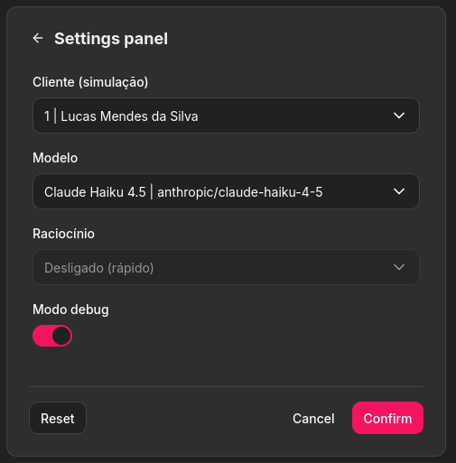

# Music Emporium Case Study

Customer-service assistant agent prototype for the fictional "Empório da Música Instrumentos Musicais Ltda." — a musical instrument store.

## Documentation

- [Architecture](./docs/ARCHITECTURE.md) — central architecture reference (design, decisions, trade-offs).
- [Open Questions](./docs/OPEN_QUESTIONS.md) — unresolved design decisions.
- [Examples](./examples/) — sample conversations.

## Overview

The agent is purely informational and answers recurring customer-service questions for a musical-instrument store: business hours, order status, product price and availability, promotions, payments, shipping, return policy, warranty, and privacy. It dynamically utilizes information from two types of data sources:

- **Structured operational data**: tables `products`, `customers`, `orders`, `order_items`, `promotions` and `categories` are exposed to the agent as read-only, typed tools through a dedicated MCP server.
- **Unstructured policy data** chunked by section, embedded with BGE-M3, and retrieved from a pgvector extended database using cosine similarity search.

The agent design uses a LangGraph with a ReAct loop: it decides whether to answer directly, retrieve a policy or call any number of tools until a final answer is achievable. A LiteLLM interface selects the generation model, with the recommended default being the hosted `anthropic/claude-haiku-4-5`, and the local Ollama-powered `qwen3.5:4b` as the fallback. **Ollama** is always the local runtime for embeddings.

The full infrastructure stack runs behind a `docker` orchestration with the following containers:
- `db` (Postgres + pgvector)
- `ollama`
- `ollama-pull` and `ollama-warmup` (one-shot model download and preload)
- `ingest` (one-shot data materialization)
- `mcp` (operational-data tools)
- `backend` (FastAPI agent runtime)
- `frontend` (Chainlit chat UI)

See the full [ARCHITECTURE.md](./docs/ARCHITECTURE.md) for more details.

## Project Design Requirements

### Functional Requirements
- FR1: Receive client messages.
- FR2: Process messages using available context, data, defined policies and rules.
- FR3: Return a response to the client.
- FR4: Connect to the database to recover specific information when needed.
- FR5: Have the full session chat history or a compressed context with recent messages unchanged. The project decision is to persist the full raw transcript and defer ephemeral compression as an extension.

### Non-Functional Requirements
- NFR1: Persona aligned with the identity and tone of the Music Emporium store.
- NFR2: Asynchronous operation for supporting multiple clients.
- NFR3: Support for multiple clients without data leakage, system degradation or security issues.
- NFR4: Scope-bound conversation. Gracefully handle out-of-scope questions and requests.
- NFR5: Cost-efficient.
- NFR6: Avoid unnecessary tool calls and RAG searches and use a cache if possible.
- NFR7: Respectful, policy-compliant and safe.
- NFR8: Accurate and grounded, minimizing hallucinations as much as possible. Information used should be limited to the provided context and prompt.
- NFR9: The agent should support multiple tool calls and RAG searches for the same customer answer.
- NFR10: Agent should only speak PT-BR to the user.

## Quick Start

### Prerequisites
- Docker and Docker Compose (v2, invoked as `docker compose`)
- [OPTIONAL] Claude API key for using Anthropic models.

> If no Claude API key is configured, you will only be able to use the slower CPU-bound `qwen3.5:4b` model.

### Setup

1. Copy `.env.example` and rename it as `.env`. Optionally add your Claude API key to the `ANTHROPIC_API_KEY` field.

2. Build and start the whole stack:
```bash
docker compose up --build
```

> On the first run the `ollama-pull` service downloads `bge-m3` and `qwen3.5:4b`, `ollama-warmup` preloads them into memory (so the first message is not slowed by a cold start), and `ingest` materializes the CSVs and embeds the policy PDF. This can take several minutes depending on network and hardware. Subsequent runs reuse the `ollama_data` and `db_data` volumes.

3. Open the chat UI at <http://localhost:8001>.

> The UI signs in automatically as a local admin; no password is required.

### Live Settings Configurations
The admin settings panel allows for testing configurations and simulating multiple clients. After changing the configurations, click the "Confirm" button to create a new session with the new parameters. The default configurations were used for the tests and validations shown in [Examples](./examples/).



- `Cliente (simulação)`: Simulates a specific client. Useful for validating `order`-related questions and verifying that no data is leaked between clients.
- `Modelo`: LLM model used for generation. Includes both Claude cloud models and Ollama local models.
- `Raciocínio` controls the model's thinking phase per request. Anthropic models don't support this setting.
- `Modo debug`: Shows the model's extended thinking and all tool calls.

> Anthropic models require your API key to be configured. [Get your valid key](https://platform.claude.com/docs/en/get-api-key) and insert it into the `ANTHROPIC_API_KEY` field of your `.env` file.

### Stopping and restarting

Stop and remove the containers (volumes with downloaded models, database data, and saved conversations are kept):

```bash
docker compose down
```

Stop and remove the containers and all volumes:
```bash
docker compose down -v
```

## MCP Tools
[...]

## Configuration
Configuration is read from environment variables or a `.env` file:

| Variable | Default | Purpose |
| --- | --- | --- |
| `DATABASE_URL` | `postgresql+asyncpg://emporium:emporium@db:5432/emporium` | Backend/ingestion database |
| `MCP_DATABASE_URL` | (falls back to `DATABASE_URL`) | Read-only DB for the MCP server |
| `MCP_URL` | `http://mcp:8000/mcp` | MCP server endpoint |
| `MCP_SHARED_SECRET` | `change-me-in-production` | HMAC secret for customer context |
| `OLLAMA_BASE_URL` | `http://ollama:11434` | Ollama runtime |
| `EMBEDDING_MODEL` | `bge-m3` | Embedding model (1024-dim) |
| `OLLAMA_NUM_CTX` | `4096` | Context window for the local generation model |
| `OLLAMA_REASONING` | `false` | Default thinking mode for local models: `false` (direct, faster), `true`, `low`/`medium`/`high`, or `none` (model default). Overridable per request from the **Raciocínio** setting |
| `OLLAMA_NUM_PREDICT` | `512` | Upper bound on generated tokens for the local model |
| `DEFAULT_MODEL` | `anthropic/claude-haiku-4-5` | Recommended generation model (hosted). Falls back to the first `OLLAMA_MODEL_ALLOWLIST` entry when no API key is set |
| `OLLAMA_MODEL_ALLOWLIST` | `ollama/qwen3.5:4b` | Local models selectable in the UI and used as the no-key fallback |
| `ANTHROPIC_API_KEY` | (empty) | Enables the Anthropic models below when set |
| `ANTHROPIC_MODELS` | `anthropic/claude-haiku-4-5,anthropic/claude-sonnet-5-5` | Hosted models shown once a key is set |
| `POLICY_SIMILARITY_THRESHOLD` | `0.5` | Minimum cosine similarity for retrieval |
| `SHOW_AGENT_STEPS` | `true` | Default state of the **Modo debug** chat setting |
| `CHAINLIT_DB_URL` | (empty) | Enables thread persistence/resume when set (async SQLAlchemy URL) |
| `CHAINLIT_ADMIN_USER` | `admin` | Identifier used for the automatic local admin sign-in |
| `CHAINLIT_AUTH_SECRET` | `change-me-in-production` | Secret used to sign UI session cookies |

> See [`.env.example`](./.env.example) for a quick start environment.

## Known limitations
- The customer selector is an admin simulation used purely for testing, debugging or showcasing the system, not authentication of the end customer. A production deployment would require authentication and authorization instead of this trusted admin simulation.
- Complaint registration and human handoff are not wired to a ticketing system. The agent acknowledges complaints and points to human follow-up.
- Raw data may contain inconsistencies that are ignored. Examples include differences between the order total and the sum of the order item totals, two different WhatsApp numbers, among others.
- Prompt-injection defense is lightweight and limited to a hardened prompt, read-only tools and a scope guardrail.
- Thread persistence uses Chainlit's own tables in the same Postgres database. A deeper persistence infrastructure and data lifecycle would be required for a production environment.

## Assumptions
- WhatsApp numbers: The policy manual lists two different numbers. The number in the company contact block, `(67) 3341-4444`, is treated as the operational company contact. The number in the customer-service section, `(67) 3321-4500`, is treated as the customer-service WhatsApp contact.
- CSV may contain inconsistencies but the content is preserved without correction, even if the source may contain product name/description or specification conflicts and order totals that differ from the sum of order items. These issues are noted but considered out-of-scope for this project and the AI assistant agent.
- MCP authorization is lightweight. The backend binds the session customer to every MCP call through an HMAC-signed bearer token (`Authorization`) verified by the MCP server. This is the "signed transport mechanism" of the architecture. The MCP server rejects requests without a valid token.
- Table `order_items` carries no per-item price, so the tool `get_customer_last_orders` reports each item's `unit_price_brl` from the current catalog price. Item-level prices would therefore not reconcile with a historical order item price if one existed.

## Decision rationale
- ReAct was chosen instead of a fixed intent branching structure. Fixed routing would not be capable of dynamically selecting two or more tools as needed during a turn to solve complex questions. An iteration limit protects latency and cost without removing the multi-tool behavior required by `NFR9`.
- The MCP server is arguably overkill and overengineering for this project scope (a small music emporium). The current tools could easily be executed on the backend. The advantages of this more complex architecture revolve around more isolation and extensibility, since new and more costly tools could be integrated using this MCP server structure. For example, a future MCP tool that runs a parallel web search for music instrument information would require more compute power and wouldn't run on the same machine as the backend.
- Instead of relying on prompts or guardrails, no tool can receive customer IDs directly from the agent and therefore cannot leak data from one customer to another. The backend resolves the customer once and the tools use only that trusted context. The agent cannot request another customer's record or provide an order ID to bypass the customer boundary.
- Persona, tone, scope, lookup rules, escalation, and other behavioral directives were extracted from the policy document and written manually into the versioned system prompt. The full policy document is still chunked by sections and ingested uniformly on the vector database to be used as a RAG source.
- A minimum similarity threshold is used when retrieving with RAG to avoid using irrelevant chunks as context, like persona and tone sections. The 0.50 cutoff value was defined empirically during the development tests.
- Categories are addressed by name since they are short and few, while products are addressed by their `product_id` due to their long multi-word names like `Yamaha C40 Nylon Natural`. A numeric id is a more reliable handle for the follow-up `get_product` call than asking the model to reproduce an exact name. The id appears only in tool results, not as a user-facing value.
- `list_products_by_category` returns products ordered by price descending, backed by an index on `(category_id, price_brl)`. This indirectly makes the agent see the most expensive products first and also helps with max-price filtering.
- Both `list_products_by_category` and `search_products` accept a `max_price` so the agent can answer price-range questions directly, and are paginated (default 30 per page, with a `total` count) so the agent can page through a category instead of only seeing the most expensive items.
- The recommended default is the hosted `anthropic/claude-haiku-4-5` model due to its low cost, fast responses, good tool selection performance and PT-BR grounding. The local `ollama/qwen3.5:4b` is the second option and is configured to run on CPU.
- Hosted Anthropic models are exposed through LiteLLM only when an API key is configured. Since some customer data may be injected into the context for generation, a production system would need to consider provider privacy, PII, retention, consent, and contractual controls.
- The backend appends the session customer's first name to the system prompt at request time so the model can address the customer by name without an extra tool call. Only the first name is injected and the full profile remains behind the customer-scoped `get_customer` tool.
- The MCP server enforces read-only access in code and via a read-only DB role. This is a further security measure to prevent tools from wrongfully running write operations on the database.
- Due to the isolation of services, the frontend was not directly connected to the store database. For simplification, the frontend shows a hardcoded list of all 50 fixture customers since there is no customer-listing endpoint. This is a static fixture for this prototype.

## Future Extensions
- Agent, tool and knowledge base response caching.
- Chat compression for dealing with long chats.
- Response validation and guardrails for out-of-scope generated texts.
- Text generation and RAG performance metrics and observability.
- Retrieval reranking and RAG hyperparameter optimization. This would reduce generation costs and get better results with a more precise context.

## AI-assisted development workflow

This project was built with AI coding assistants as a core part of the workflow. The primary tool used was opencode agents, driven especially by DeepSeek models DeepSeek V4 Pro and DeepSeek V4.1 Flash. Additionally, the GPT-6 family of models was used for unbiased validation and reviews.

My workflow started with an in-depth study of the case's problem and scope. I worked to fully understand the goals for the project, take notes and write an initial AGENTS.md. I then wrote the system requirements, my initial assumptions, tech stack inclinations, open questions and overall development guidelines. This phase of the project allowed me to really understand the goal and have a clear view of the final result I would aim for.

Once the project was clearly defined in the specification documents, I researched and brainstormed with multiple agents on top of my initial architecture ideas. The architecture document was written on top of the decisions of this phase and reviewed personally.

With the full technical documentation in hand I was able to start development. Each service was developed and included in the container composition, followed by extensive manual testing of the complete system through the UI. Multiple coding session iterations were required to implement backend and tools adjustments, refine UX, optimize the prompt and fix minor bugs.

Finally, I proceeded to validate the finished project and review the documentation.